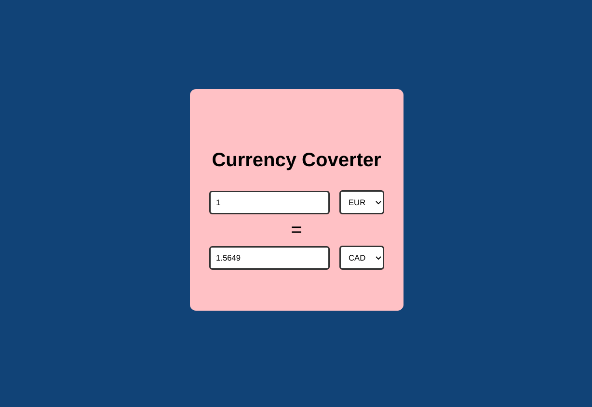

# Currency Converter 
This is a currency converter application which converts an amount in one currency to another. Made using React.

# Features

1. Allows the user to convert one currency to another. 
2. Makes an API call with the useEffect hook. API Link :  https://exchangeratesapi.io/

# Screenshot 


# Built with
1. React Hooks

# Live Demo at 
https://currencyconverterpinkman.netlify.app/

# To Run 

1. Clone into repo
2. Run ``` npm i ```
3. Run ``` npm start ```
4. Visit ``` localhost:3000 ```
